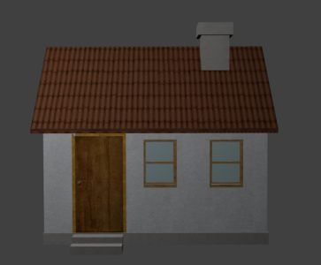
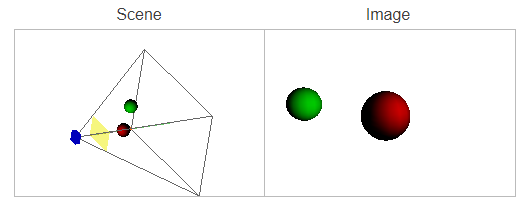
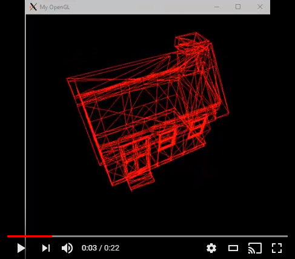
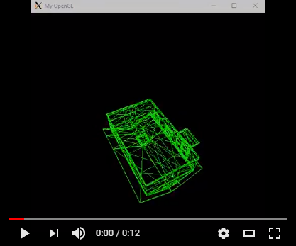

# Pipeline Gráfico

### Introdução


Neste projeto, temos como o objetivo a implementação do pipeline gráfico completo. isto é, a sequência de passos que utilizamos para transformar uma cena/objeto de sua descrição tridimensinal (definida por meio de objetos e listas de vértices, etc) para a representação em tela de um dispositivo.

Faremos uma abordagem mais 'hands-on', com enfoque na parte prática do que foi feito para permitir as transformações deste pipeline.


Este pipeline é composto das seguintes espaços e transformações entre espaços distintos:
$$
E(Objeto) \rightarrow E(Universo) \rightarrow E(Camera) \rightarrow E(Recorte) \rightarrow E(Canônico) \rightarrow E(Tela)
$$
*(1) Espaços do Pipeline Gráfico*

## 1. Carregando o Objeto:

Para fazer a carga do *mesh* do objeto na estrutura de dados, utilizei a biblioteca **[objLoader][http://www.kixor.net/dev/objloader/]**, que facilita **considerávelmente** o carregamento do objeto.

Inspirado em uma das questões da prova, escolhi como modelo uma casinha, disponível neste [link][https://free3d.com/3d-model/casa-simples-8252.html], para exibí-la em modo wireframe.


 

<p><em>Figura: Casa_Simples.obj</em></p>

Após o download, podemos verificar que o arquivo **casa.obj**, na sua estrutura interna, possui valores de vértices, faces, referências a texturas e um arquivo casa.mtl que o acompanha.

Para o intúito deste projeto, utilizaremos o *objLoader* para extrair apenas os vértices e as faces deste objeto, e geraremos uma imagem *3d wireframe* que poderemos manipular.


Agora que já temos nosso modelo. vamos para a sequência de passos para apresentá-lo!


## 2. Modelando a *Model*: Nossas Primeiras Matrizes

Durantes as aulas, nós vimos como funcionam os modelos matemáticos  para gerar nossas matrizes de escala e rotação. 

As utilizaremos para fazer nossa *primeira* transformação do pipeline: Espaço do Objeto -> Espaço do Universo
$$
M_{escala} =
\begin{bmatrix}
    S_x       & 0 & 0 & 0 \\
    0 & S_y & 0 &0  \\
    0 & 0 & S_z & 0 \\
	0 & 0 & 0 & 1
\end{bmatrix}
\ \
M_{rotacao} =
\begin{bmatrix}
    \cos(\theta) & -\sin(\theta) & 0 & 0 \\
    \sin(\theta) & \cos(\theta) & 0 &0  \\
    0 & 0 & 1 & 0 \\
	0 & 0 & 0 & 1
\end{bmatrix}
\\
M_{translacao} =
\begin{bmatrix}
    1 & 0 & 0 & d_x \\
    0 & 1 & 0 & d_y  \\
    0 & 0 & 1 & d_z \\
	0 & 0 & 0 & 1
\end{bmatrix}
$$
*(2): Matriz de escala fundamental, e exemplo de rotação sobre o eixo **z***

*-* Enfim, como passar isso pra código?

Simples, usando a biblioteca **GLM**, que possui diversas estruturas de dados (por exemplo a *mat4*, que gera uma matriz 4x4) que nos permitem que escrevamos as matrizes de forma bem similar à suas representações matemáticas:

Configuramos uma matriz MYGL_MODEL global, onde aplicamos estas transformações:

#### Matriz de Escala

```cpp
/* Matriz de Escala -> Recebe valores Sx Sy e Sz, e os escala*/
void myglScale(float sx, float sy, float sz){
    glm::mat4 scaling_matrix
    (   sx  , 0.0f, 0.0f, 0.0f,
        0.0f, sy  , 0.0f, 0.0f,
        0.0f, 0.0f, sz  , 0.0f,
        0.0f, 0.0f, 0.0f, 1.0f );
    MYGL_MODEL *= scaling_matrix;
}
```

#### Matrizes de Rotação

```cpp
/* Matriz de Rotação que permite que façamos rotações em X, Y e Z com uma chamada de função */
void myglRotate(float angle, float x, float y, float z){
    if (x != 0.0f){
        glm::mat4 rotx_matrix
        (   1.0f, 0.0f       , 0.0f        , 0.0f,
            0.0f, COSD(angle), -SIND(angle), 0.0f,
            0.0f, SIND(angle), COSD(angle) , 0.0f,
            0.0f, 0.0f       , 0.0f        , 1.0f );
        MYGL_MODEL *= rotx_matrix; }
    if (y != 0.0f){
        glm::mat4 roty_matrix
        (   COSD(angle) , 0.0f, SIND(angle), 0.0f,
            0.0f        , 1.0f,        0.0f, 0.0f,
            -SIND(angle), 0.0f, COSD(angle), 0.0f,
            0.0f        , 0.0f,        0.0f, 1.0f);
        MYGL_MODEL *= roty_matrix;} 
    if (z != 0.0f){
        glm::mat4 rotz_matrix
        (   COSD(angle), -SIND(angle), 0.0f, 0.0f,
            SIND(angle), COSD(angle) , 0.0f, 0.0f,
            0.0f       , 0.0f        , 1.0f, 0.0f,
            0.0f       , 0.0f        , 0.0f, 1.0f);
        MYGL_MODEL *= rotz_matrix; }
}
```

#### Matriz de Translação

```cpp
void myglTranslate(float dx, float dy, float dz)
{
    glm::mat4 trans_matrix
       (1.0f, 0.0f, 0.0f, dx,
        0.0f, 1.0f, 0.0f, dy,
        0.0f, 0.0f, 1.0f, dz,
        0.0f, 0.0f, 0.0f, 1.0f);
    MYGL_MODEL *= trans_matrix;
}
```


Aplicando todas estas transformações na MYGL_MODEL, fnalmente teremos colocado nosso objeto no sistema de coordenadas do mundo. (o espaço do universo). 


## 3. Luz, Câmera, Ação! Saindo do Espaço do Universo para o da Câmera e a Matrix View

Agora, já que já temos nosso objeto no universo, é hora de apontar uma câmera pra ele. e entender o que *exatamente* essa câmera faz e o que ela vê

Intuitivamente, quando pensamos em uma câmera, três coisas são importantes de se observar: 

* Pra onde que ela estar olhando? (nosso **look_at** )
* Pra onde a cima dela tá apontando? (nosso **up**)
* Em que direção ela está olhando? (nosso **position**)

Com isso em mente, temos **tudo** que precisamos para montar uma câmera em relação à um espaço de mundo.

Óbviamente a câmera não se encontra no mesmo lugar que o centro do mundo ou do objeto, então, precisamos fazer alguns cálculos *matemágicos*, para entender o que a câmera está observando.

Pra chegar lá, temos que calcular alguns produtos vetoriais:
$$
Z_{c} = - \frac{-d}{|d|} = (Z_{cx} , Z_{cy} ,Z{cz})
\\
X_{c} = \frac{u_{c}\times z_{c}}{u_{c}\times z_{c}} = (X_{cx} ,X_{cy} ,X_{cz})
\\
Y_{c} = \frac{z_{c}\times x_{c}}{z_{c}\times x_{c}} = (Y_{cx} , Y_{cy} , Y_{cz} )
$$


Por fim, sabemos que a matriz **view** é composta da combinação destas duas matrizes, e podemos populá-las com os valores descobertos acima:
$$
B^T = \begin{bmatrix}
    X_{cx} & X_{cy} & X_{cz} & 0 \\
   Y_{cx} & Y_{cy} & Y_{cz} & 0   \\
   Z_{cx} & Z_{cy} & Z_{cz} & 0  \\
	0 & 0 & 0 & 1
\end{bmatrix}
T =
\begin{bmatrix}
    1 & 0 & 0 & -P_{x} \\
    0 & 1 & 0 & -P_{y}  \\
    0 & 0 & 1 & -P_{z} \\
	0 & 0 & 0 & 1
\end{bmatrix}
$$
*(3) B^T sendo uma matriz compostas de vários produtos vetoriais entre os valores de up, position e look_at, e T sendo uma translação para a mudança de base*

Colocando estes cálculos em forma de código:

```cpp
/* myglLookAt recebe os vetores do look, da direção e do up, e calcula a matrizview*/
void myglLookAt(float lookX,float lookY,float lookZ, float directionX, 
                float directionY, float directionZ, float upX,float upY,float upZ){
    glm::vec3 look(lookX, lookY, lookZ);
    glm::vec3 direction(directionX, directionY, directionZ);
    glm::vec3 up(upX, upY, upZ);
    glm::vec3 cameraZ = -(glm::normalize(direction - look));
    glm::vec3 cameraX = glm::normalize(glm::cross(up, cameraZ));
    glm::vec3 cameraY = glm::normalize(glm::cross(cameraZ, cameraX));
    glm::mat4 B
    (   cameraX[0], cameraY[0], cameraZ[0], 0.0f,
        cameraX[1], cameraY[1], cameraZ[1], 0.0f,
        cameraX[2], cameraY[2], cameraZ[2], 0.0f,
        0.0f   , 0.0f   , 0.0f   , 1.0f); 
    glm::mat4 T
    (   1.0f, 0.0f, 0.0f, -look[0],
        0.0f, 1.0f, 0.0f, -look[1],
        0.0f, 0.0f, 1.0f, -look[2],
        0.0f, 0.0f, 0.0f, 1.0f  );
 
    MYGL_VIEW = T * glm::transpose(B); 
}
```


Feito isso, *voilá*, temos nossa matriz VIEW, já estamos no espaço da câmera!. só mais algumas transformações de espaços e estaremos projetando na tela! :)


## 4. Colocando em Perspectiva: A Matriz de Projeção

Agora estamos no espaço da câmera, isso é, depois de todas essas transformações, um vértice que tiver valor de x e y iguais a 0 devem estar sendo renderizados no centro da tela. mas como sabemos, não podemos usar apenas coordenadas x e y num espaço 3D, o Z é importante.

Se tivermos dois vértices x e y com coordenadas similares, o vértice com maior *Z*, é o que deve estar mais para o centro da tela que o outro.

E, mais uma vez pergunto: como faremos isto?

Utilizando uma técnica chamada **Projeção Perspectiva**!



*Imagem: visão da cena ao lado esquerdo e imagem vista através da distorção perspectiva à direita.*

*Uma das melhores formas de entender intuitivamente o que essa tal de projeção perspectiva faz é [Fuçar um pouco com as distorções possíveis através deste link][http://ksimek.github.io/perspective_camera_toy.html]*

Utilizamos mais uma matriz pra gerar ela, desta vez, relativamente simples:
$$
M_{projecao} =
\begin{bmatrix}
    1 & 0 & 0 & 0 \\
    0 & 1 & 0 & 0  \\
    0 & 0 & 1 & 0 \\
	0 & 0 & -\frac{1}d & 1
\end{bmatrix}
$$


A Implementação é relativamente simples, inicialmente temos MYGL_PROJECTION carregado com a matriz identidade. depois só multiplicamos pelos valores da distância escolhida.

```cpp
void myglPerspective(float dist){
    MYGL_PROJECTION[2][3] = dist; MYGL_PROJECTION[3][2] = -1 / dist;
    MYGL_PROJECTION[3][3] = 0;}
```


É Neste estágio que juntamos com as matrizes Model e View e a de Projeção para gerar a Matriz *ModelViewProjection*, que é o produto delas, e que usaremos no próxima transformação de espaço.


## 5. O Espaço Canônico e de Tela: Preparações Finais e Exibindo na Tela

Nesta etapa, iremos utilizar o que chamamos de *fulstrum*, que consiste de um recorte do espaço anterior, obtido através da homogeinização.

Neste espaço tempos de forma garantida que todos os vértices terão valores entre -1 e 1 e é obtido depois que tratamos os vertices multiplicando pela *ModelViewProjection* e dividindo as coordenadas dele pela coordenada homogênea *w*.

Através destes valores é que preparamos os vértices para serem rasteirizados na tela, os multplicando por mais outra matriz: a ViewPort, que é definida por uma sequencia de passos:

* Inversão do eixo **y**
* Uma Escala em Relação à largura e altura da tela
* Translação em relação à largura e altura da tela.

$$
M_{viewport} =
\begin{bmatrix}
    1 & 0 & 0 & \frac{width-1}2 \\
    0 & 1 & 0 & \frac{height-1}2  \\
    0 & 0 & 1 & 0 \\
	0 & 0 & 0 & 1
\end{bmatrix}
\begin{bmatrix}
    \frac{width}2 & 0 & 0 & 0 \\
    0 & \frac{height}2 & 0 & 0  \\
    0 & 0 & 1 & 0 \\
	0 & 0 & 0 & 1
\end{bmatrix}
\begin{bmatrix}
    1 & 0 & 0 & 0 \\
    0 & -1 & 0 & 0  \\
    0 & 0 & 1 & 0 \\
	0 & 0 & 0 & 1
\end{bmatrix}
$$


Em forma de código, se repete as mesmas matrizes utilizadas nos passos anteriores, recebendo a altura e largura da tela como parâmetro.


## 6. Resultados

Como fui bastante inspirado na primeira prova, resolvi criar tanto o wireframe da casinha vermelha, em suas proporções corretas, quanto outro, com ela verde, e invertida (como na questão da avaliação).





Em vídeo:

* Wireframe da Casinha pintada de vermelho, rotacionando em 3D:  https://youtu.be/O0LBT9bRqq8

* A Casinha, Invertida e Entortada, Similar à uma questão da avaliação: https://youtu.be/7wJMuexeEqo


## Dificuldades:

* Mais uma vez, alguns anacronismos da linguagem C++ dificultam a implementação, principalmente para manter o código enxuto, portanto o código não ficou tão elegante quanto eu gostaria.
* Ponteiros, Ponteiros, Ponteiros: trabalhar com ponteiros adiciona todo um desafio extra
* Carregar Arquivos: tentei utilizar o assimp, mas a solução final foi utilizar o **objloader** mesmo.


## Referências:

Luiz Henrique - Pipeline Gráfico http://luizhenriquefbb.blogspot.com/2016/10/pipeline-grafico.html

Livro: John Vince - Mathematics for Computer Graphics

OpenGL Tutorial - Matrices http://www.opengl-tutorial.org/beginners-tutorials/tutorial-3-matrices/#the-model-matrix


