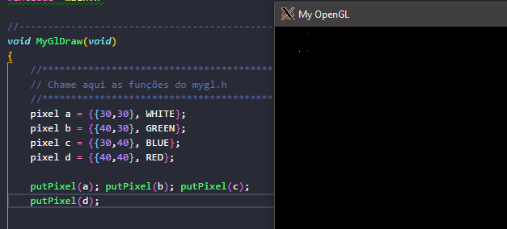
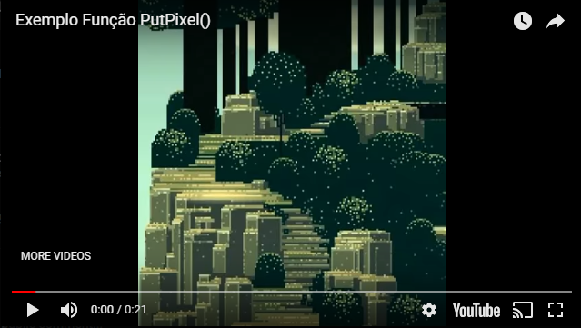
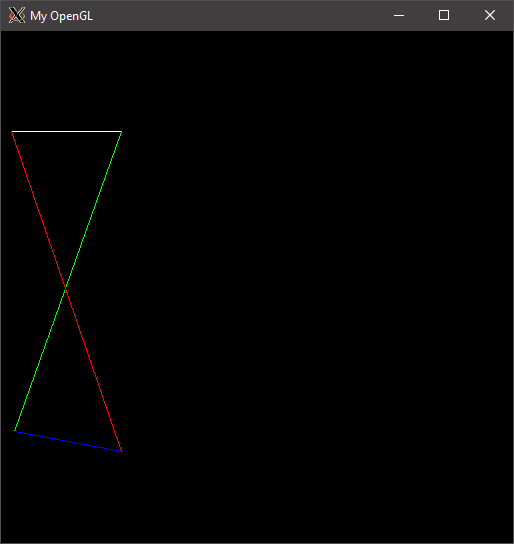

## Desenhando linhas e figuras geométricas no Computador: Computação Gráfica na Prática!

Este artigo irá documentar uma das atividades executadas na disciplina "Introdução á Computação Gráfica", Ministrada pelo professor Christan Pagot da Universidade Fedaral da Paraíba.


## Parte 1: Setup.
Para podermos rodar o código de forma satisfatória no Windows 10, precisamos ativar a funcionalidade do Windows Subsystem for Linux, e baixar uma distribuição compatível, como o [Ubuntu 18.10](https://www.microsoft.com/store/productId/9N9TNGVNDL3Q), disponível gratuitamente na loja da microsoft.

Antes de compilar o framework usando o make, precisamos instalar algumas bibliotecas:

```sh
sudo apt install libglu1-mesa-dev freeglut3-dev
```
E também ferramenta [VcxSrv](https://sourceforge.net/projects/vcxsrv/) para podermos abrir um display X11 no sistema de janelas do Windows.

Sem mais delongas, vamos ao desenvolvimento!

## Parte 2: Escolhas Técnicas

Para este projeto, decidimos por criar algumas estruturas para representar as informações que serão utilizadas nos algorítimos e funções que serão desenvolvidas aqui, entre elas o renomeamento de alguns tipos para tornar a leitura do código mais concisa:
* Montamos uma estrutura para armazenar os valores RGBA (color), uma para armazenar as coordenadas de posicionamento (pos), e uma que agrega estas duas (pixel). além disso, definimos por padrão algumas estruturas de valores de cores (RED, GREEN, BLUE, WHITE, etc).

```c++
typedef unsigned int u2; // para simplificar a escrita
typedef struct{u2 r,g,b,a;}color; //cor
typedef struct{u2 x,y;}pos; // posição (x,y)
typedef struct{pos p; color c;}pixel; //ambos
```


## Parte 3: Desenhando na Tela, Ponto-a-Ponto.

Para este projeto, utilizamos o framework fornecido pelo professor para simular o acesso direto ao Frame Buffer do monitor.


Para podermos pintar um pixel na tela, isto é, rasteirizá-lo, devemos seguir esses passos:
* Neste framework, cada Pixel possui 4 bytes, sendo cada um deles responsável por uma caracteristica de cor (RGBA), indicados por posições no array **FBptr[]**
* Precisamos calcular o offset de cada pixel que precisamos pintar, utilizamos a seguinte fórmula:

(onde x e y são as coordenadas horizontais e verticais da tela, respectivamente. )

* a função putPixel() recebe uma estrutura pixel e preenche o array do Frame Buffer com os valores definidos dentro da estrutura, o renderizando na tela.

```c++
void  putPixel(pixel px){
u2 ptr = (IMAGE_WIDTH*px.p.y + px.p.x)*4;
FBptr[ptr] = px.c.r;   FBptr[ptr+1] = px.c.g;
FBptr[ptr+2] = px.c.b; FBptr[ptr+3] = px.c.a;
}
```

<p align="center">
	<br>
	
	<h5 align="center">Figura 1: Desenhando quatro pontos coloridos na tela</h5>
	<br>
</p>


Para fazer um teste de estresse com a função putpixel(), criamos um função de geração de pixeis aleatórios e [montamos um video](https://www.youtube.com/watch?v=_GSBJzKuFSA) que mostra a renderização de vários pontos aleatórios da tela utilizando essa função.

```c++
void randomPixels(){
    pixel x = {{std::rand() % IMAGE_WIDTH, std::rand() % IMAGE_HEIGHT}, {std::rand() % 256, std::rand() % 256,std::rand() % 256}};
    putPixel(x);
}
```

<p align="center">
	<br>
	<a href=https://www.youtube.com/watch?v=_GSBJzKuFSA></a>
	<h5 align="center">Figura 2: PutPixel() gerando pontos randômicos</h5>
	<br>
</p>

# Parte 4: Rasteirizando Linhas com a função drawLine()

Para que possamos desenhar uma linha, é necessário que tenhamos acesso à, ao menos dois pontos por onde ela passa.
Matemáticamente, linhas possuem *infinitos* pontos. já monitores possuem apenas um número limitado de pixels.
ou seja, só é possível desenhar *aproximações* de tais linhas: um dos algorítimos ensinados em sala de aula é o [Algorítimo de Bresenham](https://en.wikipedia.org/wiki/Bresenham%27s_line_algorithm), que, em sua forma não-geral, nos permite desenhar linhas de até, no máximo, 45 graus.

Para **generalizar** a funcionalidade deste algorítimo e fazer com que tal funcione em todos os 8 possíveis octantes da tela é entender que:
* precisamos *espelhar*


```c++

void drawLine(pixel start, pixel end){
    s8 x0 = start.p.x, y0 = start.p.y;
    s8 x1 = end.p.x, y1 = end.p.y;

    s8 dx =  abs(x1-x0), sx = x0<x1 ? 1 : -1;
    s8 dy = -abs(y1-y0), sy = y0<y1 ? 1 : -1; 
    s8 err = dx+dy, e2; /* error value e_xy */
 

while(true){ 
    pixel px = {{x0, y0}, start.c};

    putPixel(px);
    if (x0==x1 && y0==y1) break;
    s8 e2 = 2*err;
    if (e2 >= dy) { err += dy; x0 += sx; } /* e_xy+e_x > 0 */
    if (e2 <= dx) { err += dx; y0 += sy; } /* e_xy+e_y < 0 */
}
}
```

<p align="center">
	<br>
	
	<h5 align="center">Figura 3: exemplos de linhas gerandas pelo drawLine()</h5>
	<br>
</p>

## Referências:
Gerador de Pontos para teste https://www.librec.net/datagen.html

Bresenham's line algorithm - Wikipédia https://en.wikipedia.org/wiki/Bresenham%27s_line_algorithm

The Beauty of Bresenham's Algorithm - http://members.chello.at/easyfilter/bresenham.html

Bresenham Algorithm - Optimized Line Drawing Code](https://wrf.ecse.rpi.edu//Research/Short_Notes/bresenham.html
