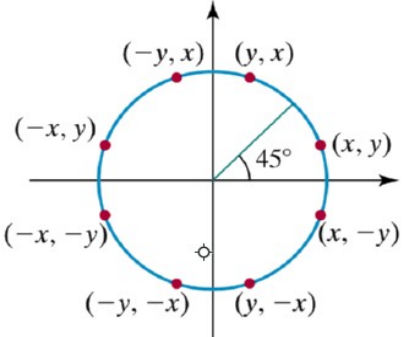

## Desenhando linhas e figuras geométricas no Computador: Computação Gráfica na Prática!

Este artigo irá documentar, na prática, como desenhar pontos, linhas e triângulos coloridos em um frame buffer, e é uma das atividades executadas na disciplina "Introdução á Computação Gráfica", Ministrada pelo professor Christan Pagot, na Universidade Fedaral da Paraíba.


## Parte 1: Setup.
Para podermos rodar o código de forma satisfatória no Windows 10, precisamos ativar a funcionalidade do Windows Subsystem for Linux, e baixar uma distribuição compatível, como o [Ubuntu 18.10](https://www.microsoft.com/store/productId/9N9TNGVNDL3Q), disponível gratuitamente na loja da microsoft.

Antes de compilar o framework usando o make, precisamos instalar algumas bibliotecas:

```sh
sudo apt install libglu1-mesa-dev freeglut3-dev
```
E também ferramenta [VcxSrv](https://sourceforge.net/projects/vcxsrv/) para podermos abrir um display X11 no sistema de janelas do Windows.

Sem mais delongas, vamos ao desenvolvimento!

## Parte 2: Escolhas Técnicas

Para este projeto, decidimos por criar algumas estruturas para representar as informações que serão utilizadas nos algorítimos e funções que serão desenvolvidas aqui, entre elas o renomeamento de alguns tipos para tornar a leitura do código mais concisa:
* Montamos uma estrutura para armazenar os valores RGBA (color), uma para armazenar as coordenadas de posicionamento (pos), e uma que agrega estas duas (pixel). além disso, definimos por padrão algumas estruturas de valores de cores (RED, GREEN, BLUE, WHITE, etc).

```c++
typedef unsigned int u2; // para simplificar a escrita
typedef struct{u2 r,g,b,a;}color; //cor
typedef struct{u2 x,y;}pos; // posição (x,y)
typedef struct{pos p; color c;}pixel; //ambos
```


## Parte 3: Desenhando na Tela, Ponto-a-Ponto.

Para este projeto, utilizamos o framework fornecido pelo professor para simular o acesso direto ao Frame Buffer do monitor.


Para podermos pintar um pixel na tela, isto é, rasteirizá-lo, devemos seguir esses passos:
* Neste framework, cada Pixel possui 4 bytes, sendo cada um deles responsável por uma caracteristica de cor (RGBA), indicados por posições no array **FBptr[]**
* Precisamos calcular o offset de cada pixel que precisamos pintar, utilizamos a seguinte fórmula:

(onde x e y são as coordenadas horizontais e verticais da tela, respectivamente. )

* a função putPixel() recebe uma estrutura pixel e preenche o array do Frame Buffer com os valores definidos dentro da estrutura, o renderizando na tela.

```c++
void  putPixel(pixel px){
u2 ptr = (IMAGE_WIDTH*px.p.y + px.p.x)*4;
FBptr[ptr] = px.c.r;   FBptr[ptr+1] = px.c.g;
FBptr[ptr+2] = px.c.b; FBptr[ptr+3] = px.c.a;
}
```

<p align="center">
	<br>
	
	<h5 align="center">Figura 1: Desenhando quatro pontos coloridos na tela</h5>
	<br>
</p>


Para fazer um teste de estresse com a função putpixel(), criamos um função de geração de pixeis aleatórios e [montamos um video](https://www.youtube.com/watch?v=_GSBJzKuFSA) que mostra a renderização de vários pontos aleatórios da tela utilizando essa função.

```cpp
void randomPixels(){
    pixel x = {{std::rand() % IMAGE_WIDTH, std::rand() % IMAGE_HEIGHT}, {std::rand() % 256, std::rand() % 256,std::rand() % 256}};
    putPixel(x);
}
```

<p align="center">
	<br>
	
	<h5 align="center">Figura 2: PutPixel() gerando pontos randômicos - [Video](https://www.youtube.com/watch?v=_GSBJzKuFSA)</h5>
	<br>
</p>

# Parte 4: Rasteirizando Linhas com a função drawLine()

Para que possamos desenhar uma linha, é necessário que tenhamos acesso à, ao menos dois pontos por onde ela passa.
Matemáticamente, linhas possuem *infinitos* pontos. já monitores possuem apenas um número limitado de pixels.
ou seja, só é possível desenhar *aproximações* de tais linhas: um dos algorítimos ensinados em sala de aula é o [Algorítimo de Bresenham](https://en.wikipedia.org/wiki/Bresenham%27s_line_algorithm), que, em sua forma não-geral, nos permite desenhar linhas de até, no máximo, 45 graus.

Para **generalizar** a funcionalidade deste algorítimo e fazer com que tal funcione em todos os possiveis níveis de inclinação da tela é entender que, é necessário observar em qual octante a linha vai ser desenhada, para configurar os incrementos ou decrementos à serem feitos ao desenhar a linha.

<p align="center">
	<br>
	
	<h5 align="center">Figura 3: Representação dos Octantes()</h5>
	<br>
</p>

* calculamos a distancia absoluta entre o valor do x e y final e inicial. (dx e dy)
* criamos uma variavel para verificar se devemos incrementar ou decrementar os valores de x e y no desenho da linha (ix e iy)
	* tanto para o cada caso x e y, se o valor do inicio for menor que o fim, seta-se que o loop do programar irá incrementar o valor do pixel à ser pintado, caso contrario, ele será decrementado.
* assim, podemos tratar todos os possíveis casos, pois podemos escolher individualmente decrementar o eixo x ou y.

### Implementação da função
```c++
void drawLine(pixel start, pixel end){
    /* desempacotando o pixel */
    s8 x0 = start.p.x, y0 = start.p.y; //desempacota o pixel
    s8 x1 = end.p.x, y1 = end.p.y;
    
    /* incremento/decremento de x e y */
    s8 ix = x0<x1 ? 1 : -1;
    s8 iy = y0<y1 ? 1 : -1; 
    
    /* erros */ 
    s8 err = dx+dy;

    /* loop de desenho da linha */
    while(true){ 
        pixel px = {{x0, y0}, px.c};
        putPixel(px);
        if (x0==x1 && y0==y1) break; // para quando o destino for a origem
        s8 er2 = 2*err; // calculo do err
        if (er2 >= dy) { err += dy; x0 += ix; } 
        if (er2 <= dx) { err += dx; y0 += iy; } 
    }
}

```
<p align="center">
	<br>
	
	<h5 align="center">Figura 4: exemplos de linhas gerandas pelo drawLine()</h5>
	<br>
</p>

## Parte 5: Interpolando Cores

Nesse passo, iremos criar um gradiente que colorirá nossa reta do ponto inicial ao final. indo da cor de um ponto, para a cor do outro, utilizando uma técnica chamada Interpolação Linear. [(mais informações aqui)](https://pt.wikipedia.org/wiki/Interpola%C3%A7%C3%A3o_linear) 

* Passo 1: Para tal, devemos acessar os valores de cor dos pixels de inicio e fim, e subtraír o valor final do inicial, (em um processo similar ao calculo do dx e dy)
* Passo 2: Também calculamos o tamanho total da linha, tirando a raiz do quadrado do dx somado ao quadrado do dy, que calculamos anteriormente.
* Subtraindo o valor descoberto no passo 1 pela distância dos pixeis calculado no passo 2, podemos descobrir o incremento de cada valor RGBA para iteração do desenho do pixel.

* fazendo as alterações necessarias na função DrawLine(), obtemos a seguinte função:
```c++
void drawLine(pixel start, pixel end){
    /* desempacotando o pixel */
    s8 x0 = start.p.x, y0 = start.p.y; 
    s8 x1 = end.p.x, y1 = end.p.y;
    /* dx e dy */
    s8 dx =  abs(x1-x0); 
    s8 dy = -abs(y1-y0);
    /* incremento/decremento de x e y */
    s8 ix = x0<x1 ? 1 : -1;
    s8 iy = y0<y1 ? 1 : -1; 
    s8 err = dx+dy;

    /* interpolacao de cor */

    f8 var = sqrt(pow(dx,2) + pow(dy,2));        
    f8 r0 = start.c.r, g0 = start.c.g, b0 = start.c.b;
    f8 mod_r = ((end.c.r - start.c.r) / var);
    f8 mod_g = ((end.c.g - start.c.g) / var);
    f8 mod_b = ((end.c.b - start.c.b) / var);

    /* loop principal */

    while(true){ 
        color cx = {round(r0 += mod_r), round(g0 += mod_g), round(b0 += mod_b), 255};
        pixel px = {{x0, y0}, cx};
        putPixel(px);
        if (x0==x1 && y0==y1) break;
        s8 er2 = 2*err;
        if (er2 >= dy) { err += dy; x0 += ix; } 
        if (er2 <= dx) { err += dx; y0 += iy; } 
    }
}
}
```

<p align="center">
	<br>
	
	<h5 align="center">Figura 5: exemplos de linhas com interpolacão de cor</h5>
	<br>
</p>


## Parte 5: Desenhando um Triangulo com o DrawTriangle()

Para desenhar um triângulo, basta escolher três pontos, e utilizar a função DrawLine de forma à criar um ciclo.

### A função:
```c++
void drawTriangle(pixel a, pixel b, pixel c){
    drawLine(a,b); drawLine(b,c); drawLine(c,a);
}
```

<p align="center">
	<br>
	
	<h5 align="center">Figura 6: desenho de um Triângulo</h5>
	<br>
</p>

 

## Dificuldades:
* Em primeiro lugar, minha falta de familiaridade e experiência com a linguagem (C++), o que resultou em dezenas de tentativas de montagens utilizando estruturas pythonescas que não traduzem bem para o C++, além dos constantes esquecimentos de ponto-e-virgula. 
* Inicialmente, tentei montar usando orientação a objeto, mas por fim decidir montar de maneira imperativa.
* Encontrar uma forma relativamente compacta (e funcional) de generalizar o algoritimo de Bresenham para todos os octantes, utilizando operações aritméticas simples.
* Sem dúvida alguma, a interpolação das cores nas linhas foi a parte mais difícil de montar. entre as dezenas de erros na montagem do meu código, um dos mais gritantes foi o conflito de tipos. já que cores são representadas como unsigned char (0-255) e a variação é representada como float, ela não estava sendo computada corretamente. demorei mais que algumas horas pra conseguir tal façanha.


## Referências:
Gerador de Pontos para teste https://www.librec.net/datagen.html

Bresenham's line algorithm - Wikipédia https://en.wikipedia.org/wiki/Bresenham%27s_line_algorithm

The Beauty of Bresenham's Algorithm - http://members.chello.at/easyfilter/bresenham.html

Bresenham Algorithm - Optimized Line Drawing Code - https://wrf.ecse.rpi.edu//Research/Short_Notes/bresenham.html

Ednaldo Martins - Rasteirização de Linhas - https://ednaldomartinscg2016.blogspot.com/2017/02/v-behaviorurldefaultvmlo.html
